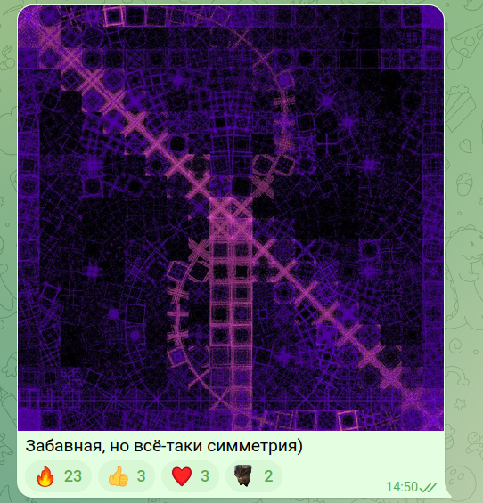

# Шаблон Java-проекта для домашних заданий

Шаблон для домашних заданий [Академии Бэкенда 2024][course-url].

Цель данного репозитория – познакомить вас с процессом разработки приложений на
Java с использованием наиболее распространенных практик, инструментов и
библиотек.

## Структура проекта

Это типовой Java-проект, который собирается с помощью инструмента автоматической
сборки проектов [Apache Maven](https://maven.apache.org/).

Проект состоит из следующих директорий и файлов:

- [pom.xml](./pom.xml) – дескриптор сборки, используемый maven, или Project
  Object Model. В нем описаны зависимости проекта и шаги по его сборке
- [src/](./src) – директория, которая содержит исходный код приложения и его
  тесты:
  - [src/main/](./src/main) – здесь находится код вашего приложения
  - [src/test/](./src/test) – здесь находятся тесты вашего приложения
- [mvnw](./mvnw) и [mvnw.cmd](./mvnw.cmd) – скрипты maven wrapper для Unix и
  Windows, которые позволяют запускать команды maven без локальной установки
- [checkstyle.xml](checkstyle.xml),
  [checkstyle-suppression.xml](checkstyle-suppression.xml), [pmd.xml](pmd.xml) и
  [spotbugs-excludes.xml](spotbugs-excludes.xml) – в проекте используются
  [линтеры](https://en.wikipedia.org/wiki/Lint_%28software%29) для контроля
  качества кода. Указанные файлы содержат правила для используемых линтеров
- [.mvn/](./.mvn) – служебная директория maven, содержащая конфигурационные
  параметры сборщика
- [lombok.config](lombok.config) – конфигурационный файл
  [Lombok](https://projectlombok.org/), библиотеки помогающей избежать рутинного
  написания шаблонного кода
- [.editorconfig](.editorconfig) – файл с описанием настроек форматирования кода
- [.github/workflows/build.yml](.github/workflows/build.yml) – файл с описанием
  шагов сборки проекта в среде Github
- [.gitattributes](.gitattributes), [.gitignore](.gitignore) – служебные файлы
  для git, с описанием того, как обрабатывать различные файлы, и какие из них
  игнорировать

## Начало работы

Подробнее о том, как приступить к разработке, описано в разделах
[курса][course-url] `1.8 Настройка IDE`, `1.9 Работа с Git` и
`1.10 Настройка SSH`.

Для того чтобы собрать проект, и проверить, что все работает корректно, можно
запустить из модального окна IDEA
[Run Anything](https://www.jetbrains.com/help/idea/running-anything.html)
команду:

```shell
mvn clean verify
```

Альтернативно можно в терминале из корня проекта выполнить следующие команды.

Для Unix (Linux, macOS, Cygwin, WSL):

```shell
./mvnw clean verify
```

Для Windows:

```shell
mvnw.cmd clean verify
```

Для окончания сборки потребуется подождать какое-то время, пока maven скачает
все необходимые зависимости, скомпилирует проект и прогонит базовый набор
тестов.

Если вы в процессе сборки получили ошибку:

```shell
Rule 0: org.apache.maven.enforcer.rules.version.RequireJavaVersion failed with message:
JDK version must be at least 22
```

Значит, версия вашего JDK ниже 22.

Если же получили ошибку:

```shell
Rule 1: org.apache.maven.enforcer.rules.version.RequireMavenVersion failed with message:
Maven version should, at least, be 3.8.8
```

Значит, у вас используется версия maven ниже 3.8.8. Такого не должно произойти,
если вы запускаете сборку из IDEA или через `mvnw`-скрипты.

Далее будут перечислены другие полезные команды maven.

Запуск только компиляции основных классов:

```shell
mvn compile
```

Запуск тестов:

```shell
mvn test
```

Запуск линтеров:

```shell
mvn checkstyle:check modernizer:modernizer spotbugs:check pmd:check pmd:cpd-check
```

Вывод дерева зависимостей проекта (полезно при отладке транзитивных
зависимостей):

```shell
mvn dependency:tree
```

Вывод вспомогательной информации о любом плагине (вместо `compiler` можно
подставить интересующий вас плагин):

```shell
mvn help:describe -Dplugin=compiler
```

## Дополнительные материалы

- Документация по maven: https://maven.apache.org/guides/index.html
- Поиск зависимостей и их версий: https://central.sonatype.com/search
- Документация по процессу автоматизированной сборки в среде github:
  https://docs.github.com/en/actions
- Документация по git: https://git-scm.com/doc
- Javadoc для Java 22:
  https://docs.oracle.com/en/java/javase/22/docs/api/index.html

[course-url]: https://edu.tinkoff.ru/all-activities/courses/870efa9d-7067-4713-97ae-7db256b73eab

## Отчёт

Реализованно приложение для генерации изображений фрактального пламени.

### Конфигурация

Для быстрой конфигурации приложения нужно использовать файл `config.yml`.
В нём представлены следующие поля:
- **width** - ширина изображения, диапазон допустимых значений от `64` до `2048`, значение по умолчанию `1024`.
- **height** - высота изображения, диапазон допустимых значений от `64` до `2048`, значение по умолчанию `1024`.
- **affines** - список аффинных преобразований в формате `[a, b, c, d, e, f, r, g, b]`,
где `-1.5 <= a, b, c, d, e, f <= 1.5` и `0.0 <= r, g, b <= 1.0`. Значение по умолчанию:
```
 - [1.005, 0.0, 0.0, 0.0, 1.005, 0.0, 0.498, 0.0, 1.0]
 - [0.0, 1.005, 0.0, 0.0, 0.0, 1.005, 0.498, 0.0, 1.0]
 - [-0.995, 1.002, 0.0, -1.002, 0.995, 0.0, 1.0, 0.4, 0.698]
```
- **variations** - список трансформаций. Сейчас доступны следующие: 
`Linear`, `Sinusoidal`, `Spherical`, `Swirl` и `Horseshoe`.
По умолчанию список трансформаций включает в себя только линейную, то есть `Linear`.
- **samples** - диапазон допустимых значений от `128` до `Integer.MAX_VALUE`,
значение по умолчанию `512`.
- **iter-per-sample** - диапазон допустимых значений от `128` до `Short.MAX_VALUE`, 
значение по умолчанию `512`. 
- **seed** - значение по умолчанию `0`. 
- **symmetry** - параметр симметрии изображения, диапазон допустимых значений от `1` до `16`,
  значение по умолчанию `1`. 
- **is-relative-symmetry** - включает локальную симметрию, имеет смысл только при многопоточном исполнении. 
Значение по умолчанию `false`.
- **number-of-threads** - количество потоков для исполнения программы. Диапазон допустимых значений от `1` до `32767`,
  значение по умолчанию `1` (однопоточный режим).

### Результаты измерения производительности

При генерации изображения использовалась следующая конфигурация (`config.yml`):
```
width: 512
height: 512

affines:
 - [1.005, 0.0, 0.0, 0.0, 1.005, 0.0, 0.498, 0.0, 1.0]
 - [0.0, 1.005, 0.0, 0.0, 0.0, 1.005, 0.498, 0.0, 1.0]
 - [-0.995, 1.002, 0.0, -1.002, 0.995, 0.0, 1.0, 0.4, 0.698]

variations:
 - Linear
 - Sinusoidal
 - Spherical
 - Swirl
 - Horseshoe

samples: 4096
iter-per-sample: 8192

seed: 2

symmetry: 16
is-relative-symmetry: false

number-of-threads: ...

```

Измерения производились на операционной системе `Ubuntu 22.04.5 LTS x86_64` 
с использованием процессора `Intel i5-8300H (8) @ 4.000GHz` (4 ядра, 8 потоков).

| number-of-threads | time (sec) | Ускорение | Загруженность (%) |
|-------------------|------------|-----------|-------------------|
| 1                 | 72.01      | -         | -                 |
| 2                 | 31.15      | 2.31      | 116               |
| 3                 | 24.49      | 2.94      | 98                |
| 4                 | 22.45      | 3.21      | 80                |
| 5                 | 22.51      | 3.20      | 64                |
| 6                 | 23.75      | 3.03      | 51                |
| 7                 | 24.06      | 2.99      | 43                |
| 8                 | 22.83      | 3.15      | 39                |
| 9                 | 21.59      | 3.34      | 37                |
| 10                | 22.94      | 3.14      | 31                |

Как видно из таблицы наиболее целесообразно использовать 2 потока.

### Примеры



