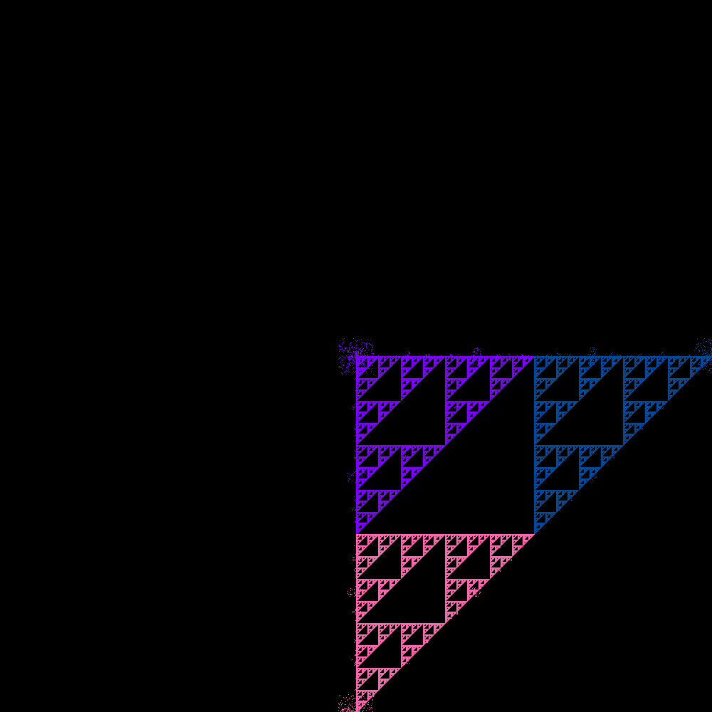

# FractalFlame

## Установка и запуск

### Требования

Для запуска игры необходима установка следующих зависимостей:
- Java 22+
- Maven (для сборки проекта)

### Установка

1. Склонируйте репозиторий:
    ```bash
    git clone https://github.com/vihlancevk/FractalFlame.git
    ```
2. Перейдите в директорию проекта:
    ```bash
    cd FractalFlame
    ```
3. Соберите проект с помощью Maven:
    ```bash
    mvn clean install
	mvn dependency:copy-dependencies
    ```
4. Запустите:
   ```bash
   java -cp target/java-1.0.0.jar:target/dependency/* backend.academy.Main
   ```

## Отчёт

Реализованно приложение для генерации изображений фрактального пламени.

### Конфигурация

Для быстрой конфигурации приложения нужно использовать файл `config.yml`.
В нём представлены следующие поля:
- **width** - ширина изображения, диапазон допустимых значений от `64` до `2048`, значение по умолчанию `1024`.
- **height** - высота изображения, диапазон допустимых значений от `64` до `2048`, значение по умолчанию `1024`.
- **affines** - список аффинных преобразований в формате `[a, b, c, d, e, f, r, g, b]`,
где `-1.5 <= a, b, c, d, e, f <= 1.5` и `0.0 <= r, g, b <= 1.0`. Значение по умолчанию:
```
 - [1.005, 0.0, 0.0, 0.0, 1.005, 0.0, 0.498, 0.0, 1.0]
 - [0.0, 1.005, 0.0, 0.0, 0.0, 1.005, 0.498, 0.0, 1.0]
 - [-0.995, 1.002, 0.0, -1.002, 0.995, 0.0, 1.0, 0.4, 0.698]
```
- **variations** - список трансформаций. Сейчас доступны следующие: 
`Linear`, `Sinusoidal`, `Spherical`, `Swirl` и `Horseshoe`.
По умолчанию список трансформаций включает в себя только линейную, то есть `Linear`.
- **samples** - диапазон допустимых значений от `128` до `Integer.MAX_VALUE`,
значение по умолчанию `512`.
- **iter-per-sample** - диапазон допустимых значений от `128` до `Short.MAX_VALUE`, 
значение по умолчанию `512`. 
- **seed** - значение по умолчанию `0`. 
- **symmetry** - параметр симметрии изображения, диапазон допустимых значений от `1` до `16`,
  значение по умолчанию `1`. 
- **is-relative-symmetry** - включает локальную симметрию, имеет смысл только при многопоточном исполнении. 
Значение по умолчанию `false`.
- **number-of-threads** - количество потоков для исполнения программы. Диапазон допустимых значений от `1` до `32767`,
  значение по умолчанию `1` (однопоточный режим).

### Результаты измерения производительности

При генерации изображения использовалась следующая конфигурация (`config.yml`):
```
width: 512
height: 512

affines:
 - [1.005, 0.0, 0.0, 0.0, 1.005, 0.0, 0.498, 0.0, 1.0]
 - [0.0, 1.005, 0.0, 0.0, 0.0, 1.005, 0.498, 0.0, 1.0]
 - [-0.995, 1.002, 0.0, -1.002, 0.995, 0.0, 1.0, 0.4, 0.698]

variations:
 - Linear
 - Sinusoidal
 - Spherical
 - Swirl
 - Horseshoe

samples: 4096
iter-per-sample: 8192

seed: 2

symmetry: 16
is-relative-symmetry: false

number-of-threads: ...

```

Измерения производились на операционной системе `Ubuntu 22.04.5 LTS x86_64` 
с использованием процессора `Intel i5-8300H (8) @ 4.000GHz` (4 ядра, 8 потоков).

| number-of-threads | time (sec) | Ускорение | Загруженность (%) |
|-------------------|------------|-----------|-------------------|
| 1                 | 72.01      | -         | -                 |
| 2                 | 31.15      | 2.31      | 116               |
| 3                 | 24.49      | 2.94      | 98                |
| 4                 | 22.45      | 3.21      | 80                |
| 5                 | 22.51      | 3.20      | 64                |
| 6                 | 23.75      | 3.03      | 51                |
| 7                 | 24.06      | 2.99      | 43                |
| 8                 | 22.83      | 3.15      | 39                |
| 9                 | 21.59      | 3.34      | 37                |
| 10                | 22.94      | 3.14      | 31                |

Как видно из таблицы наиболее целесообразно использовать 2 потока.

### Примеры




